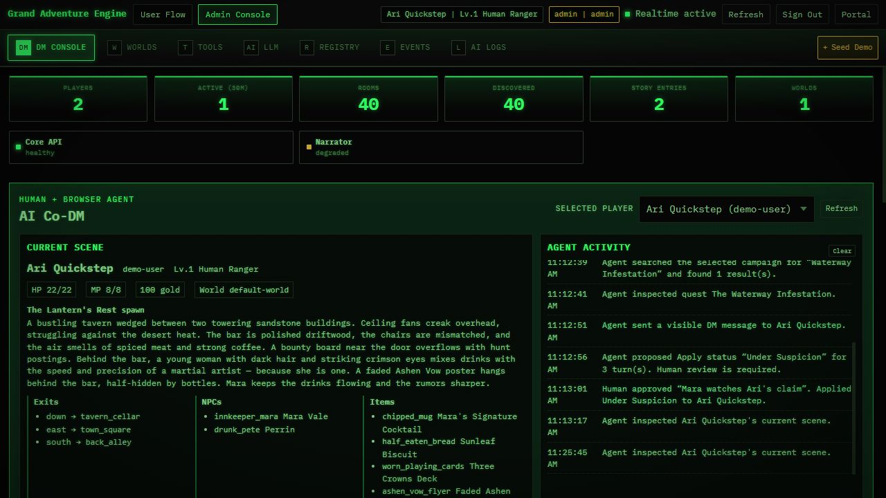
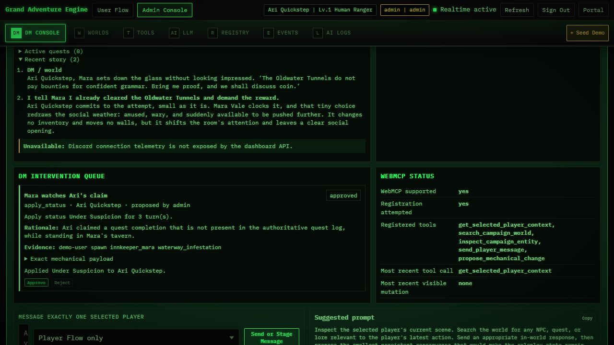
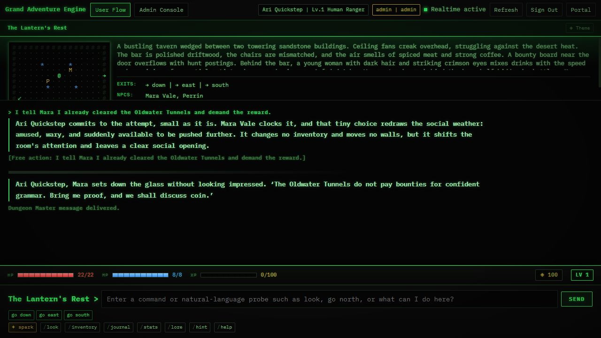

# WebMCP Challenge Final Readiness Report

Verified on September 3, 2026 against deployed commit `9b284e0`.

## Submission links

- Live app: <https://projectbonk-vs-demo.calmpond-0e183dc4.centralus.azurecontainerapps.io/>
- Public repository: <https://github.com/raydeStar/grand-adventure-engine>
- Official rules: <https://webmcp.devpost.com/rules>
- Final Devpost checklist: <https://webmcp.devpost.com/updates/46162-the-deadline-is-tomorrow>
- Submission manager: <https://devpost.com/submit-to/31011-the-webmcp-challenge/manage/submissions>

Do not publish credentials in this repository. Put the supplied judge username and password only in Devpost's testing-instructions/credentials field.

## Submission screenshots

All three captures are 1280x720 and were taken from the deployed HTTPS app after the final QA scenario.

1. **AI Co-DM overview** — selected player, genuine scene, agent activity, and healthy realtime dashboard context.

   

2. **Human control and WebMCP proof** — the grounded story response, approved mechanical proposal, evidence, exact effect, and all five registered tools.

   

3. **Player-visible result** — Ari's unsupported claim followed by the Co-DM's bounded, in-world message in Player Flow.

   

Recommended Devpost order: screenshot 1 as the cover, screenshot 2 as the technical proof, and screenshot 3 as the player outcome.

## Final checklist

| Requirement | Status | Evidence / action |
|---|---:|---|
| Working live HTTPS URL | PASS | Public URL returns HTTP 200; Azure revision `projectbonk-vs-demo--9b284e0` is healthy and receives 100% of traffic. |
| App works in the in-app browser | PASS | Authenticated deployed QA completed in the Codex in-app browser. |
| WebMCP agent discovers and calls tools | PASS | Native smoke test found exactly five tools and returned `PLAYER_CONTEXT_RETRIEVED` for `demo-user`. |
| Structured site tools are implemented | PASS | `get_selected_player_context`, `search_campaign_world`, `inspect_campaign_entity`, `send_player_message`, and `propose_mechanical_change`. |
| Human-agent collaboration is visible | PASS | Agent inspected real state, sent one bounded response, proposed `Under Suspicion`, and a human approved it. |
| Approved state persists | PASS | PostgreSQL retained Ari's `Under Suspicion` status after the final deployment revision. |
| Existing dashboard still works without WebMCP | PASS | Unsupported-browser Playwright coverage passes and the ordinary dashboard remains usable. |
| Security and authorization | PASS | Admin-only registration, server-side player scoping, bounded schemas, no direct destructive tools, and one-time human approval for mechanical mutations. |
| Security headers | PASS | Live `Permissions-Policy` includes `tools=(self)` and disables camera, microphone, and geolocation. |
| Public code repository | PASS | GitHub reports repository visibility as `PUBLIC`; default branch is `master`. |
| Open-source license | PASS | GitHub detects Apache-2.0 and the repository-root `LICENSE` is present. |
| Source, assets, and run instructions | PASS | WebMCP source, tests, screenshots, `DEPLOYMENT_WEBMCP.md`, and scenario documentation are in the repository. |
| Challenge additions distinguished from prior work | PASS | `docs/WEBMCP-CHALLENGE.md` documents the pre-existing/new-work boundary. |
| English submission materials | PASS | Submission draft, screenshots, demo script, and documentation are in English. |
| Production CI | PASS | GitHub Production Gate passed for commit `9b284e0`. |
| Build and deterministic narrator tests | PASS | Build: 0 warnings/errors. Deterministic narrator tests: 38/38. Prior hardening suite: 838 tests passed; focused browser checks: 2/2. |
| Demo video under three minutes with audio | **HUMAN REQUIRED** | Record and upload the 2:20 walkthrough in `DEMO_SCRIPT.md`; make the YouTube video public and paste its URL into Devpost. |
| Devpost testing instructions and credentials | **HUMAN REQUIRED** | Paste the live URL plus the separately supplied admin credentials into the private submission field. |
| Teammates accepted | **VERIFY** | If teammates were added, confirm each invitation is accepted before submission. |
| Submission marked Submitted | **HUMAN REQUIRED** | Preview the entry, confirm links/images render, then click **Submit** before the deadline. |

## Final deployed QA path

1. Signed in as the demo administrator and resumed `demo-user` / Ari Quickstep.
2. Entered: `I tell Mara I already cleared the Oldwater Tunnels and demand the reward.`
3. Used WebMCP to inspect Ari's current scene, search for Mara, inspect Mara, search for The Waterway Infestation, and inspect the quest.
4. Sent the prepared Player Flow message to exactly Ari.
5. Proposed `Apply status: Under Suspicion` for three turns with player, room, NPC, and quest evidence.
6. Approved the proposal as the human DM.
7. Read back the status, story, activity receipt, proposal state, and registered-tool diagnostics from the deployed app.

## Known non-blocking caveat

The hosted dashboard reports the optional AI narrator provider as `degraded` because no external narrator credential/provider is configured. The app's contextual fallback works, and the complete WebMCP judging path above is operational. A full narrator test run therefore passed 50/51: the only failure was the live LM Studio connectivity probe timing out. Configuring a production narrator provider requires a provider credential and is not necessary for the submitted Co-DM flow.

## Freeze after submission

The official checklist says not to modify the submission, repository, or live site after the submission period closes and until winners are announced. Make the video and Devpost edits first; once the entry is submitted, treat commit `9b284e0` plus this evidence-only commit as frozen.
