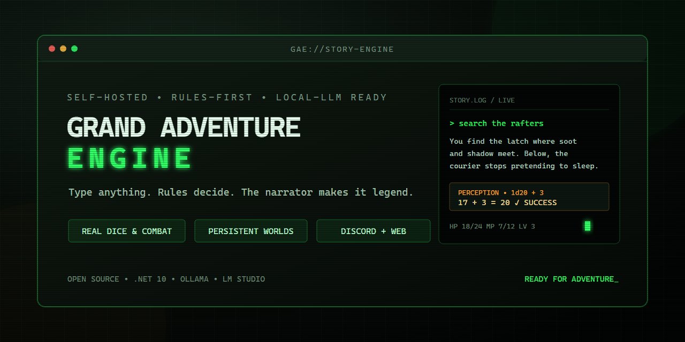
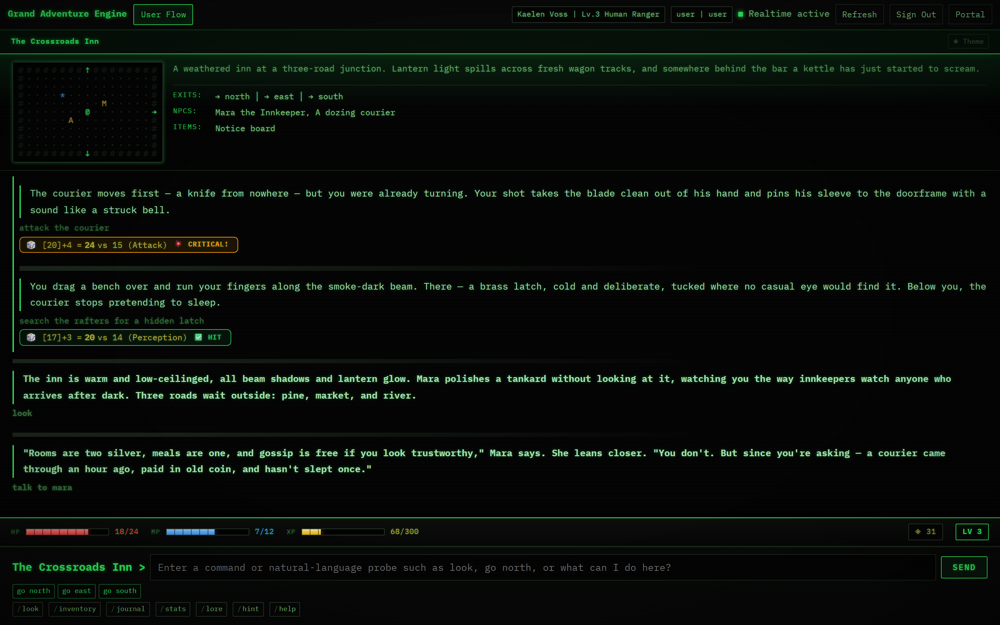
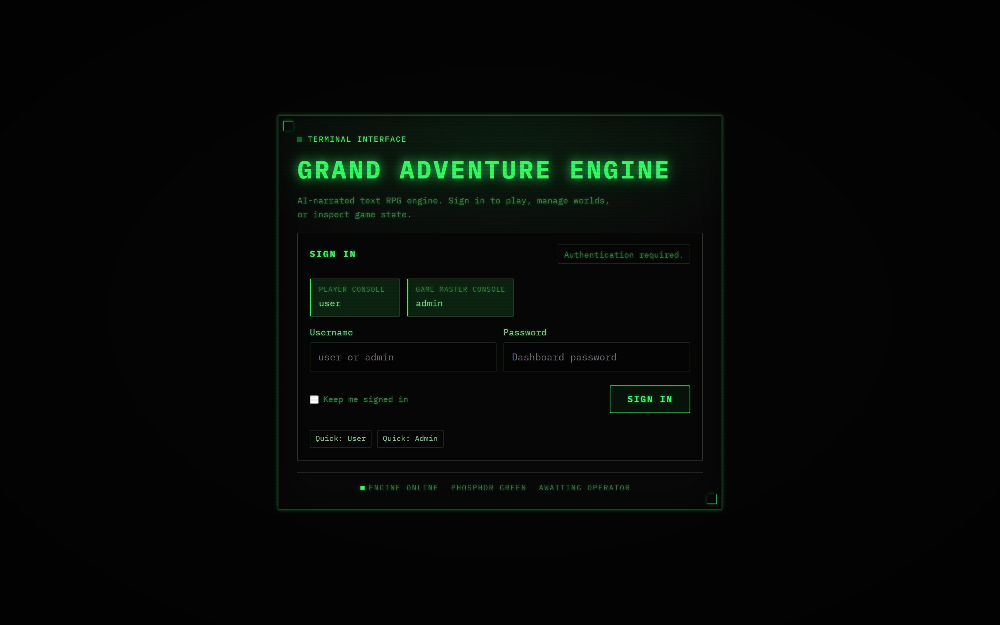
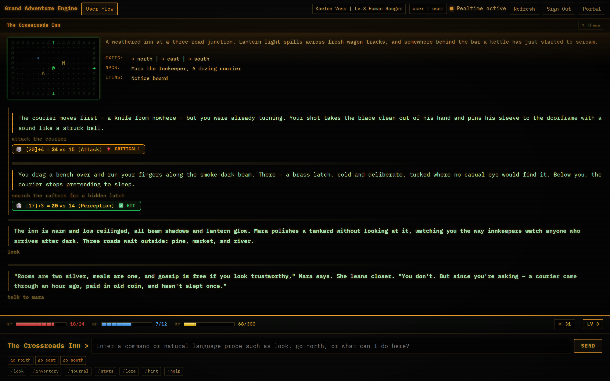
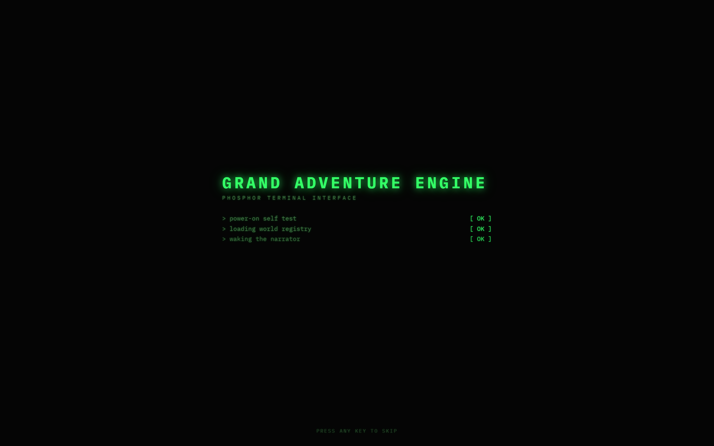
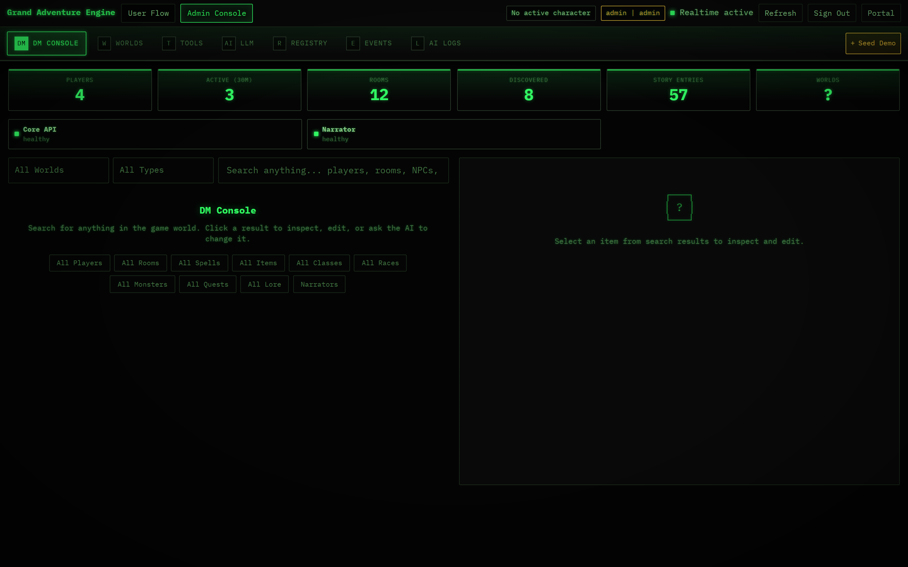

# Grand Adventure Engine

[](LICENSE) [](https://dotnet.microsoft.com/) [](docker-compose.yml)

**A self-hosted, AI-narrated text adventure game you can play in Discord or your browser.** Type what you want to do — in plain English — and an AI narrator tells you what happens, while a real game engine rolls the dice behind the scenes.



## What makes it different

Most AI storytelling apps are improv: the AI makes everything up as it goes, and nothing really counts. Grand Adventure Engine is a **game**. Your character has real stats, real inventory, and real quests. Combat is decided by dice rolls, not vibes. Shopkeepers remember if you were rude. The AI's job is to tell the story beautifully — the engine's job is to make it true.

- **Play in plain English.** Standard commands like `look`, `go north`, and `attack` work, but so does *"search the rafters for a hidden latch"* or *"flex at the bartender."* Every input matters — there are no canned "that didn't work" responses.
- **Describe a character, get a character.** Tell the game *"a sneaky goblin alchemist"* and it builds a full playable sheet: stats, gear, traits, and backstory.
- **Dice decide.** Attacks, skill checks, loot, and quest progress are resolved by game rules. Critical hits and fumbles actually happen — and the narrator reacts to what really occurred.
- **People remember you.** NPCs track how you've treated them and only know the lore they should plausibly know. The innkeeper doesn't know the dragon's weakness — but someone out there does.
- **Play where your friends are.** Run it as a Discord bot for your server, use the retro terminal-style web dashboard, or both at once.
- **Many worlds, one engine.** Each world can carry its own rules, lore, quests, portals, and NPC relationships.
- **Yours, entirely.** Self-hosted, open source, and built to run against local AI models (LM Studio or Ollama) — no required cloud AI subscription, no data leaving your machine.

## Screens



| The player console | The amber theme |
| --- | --- |
|  |  |

| Booting up | Game master tools |
| --- | --- |
|  |  |

## How it works

When you type an action, the engine — not the AI — decides the outcome:

```text
Your words  →  command parser  →  game rules & dice  →  AI narrator  →  the story
```

The narrator only describes what actually happened. If the dice say you missed, the story says you missed. If the AI backend is offline, the game keeps working with built-in narration.

New player? Start with the **[Player Guide](docs/player-guide.md)**.

## Run it yourself

You'll need [Docker Desktop](https://www.docker.com/products/docker-desktop/), the [.NET 10 SDK](https://dotnet.microsoft.com/download), and a local AI backend ([LM Studio](https://lmstudio.ai/) or [Ollama](https://ollama.com/)). A Discord bot token is optional — only needed for Discord play.

```powershell
dotnet build GrandAdventureEngine.slnx
Copy-Item .env.example .env
notepad .env   # set your passwords and AI backend
powershell -ExecutionPolicy Bypass -File .\scripts\reset-docker-stack.ps1
```

Then open the dashboard at `http://localhost:8181` and sign in (`user` / `GAE-User-Local!123` by default — change the defaults before exposing anything beyond your machine).

The full walkthrough, including Discord setup and AI backend configuration, is in the **[Self-Hosting Setup Guide](docs/setup-guide.md)**.

## Documentation

- [Player Guide](docs/player-guide.md) — how to play, all commands
- [Self-Hosting Setup Guide](docs/setup-guide.md) — full installation walkthrough
- [Dashboard Operator Guide](docs/dashboard-ops.md) — running and managing a server
- [Known Gaps](docs/known-gaps.md) — honest list of rough edges

<details>
<summary><strong>For developers</strong> — project layout and tests</summary>

| Path | Purpose |
| --- | --- |
| `src/GAE.Core` | Models and shared interfaces |
| `src/GAE.Engine` | Game rules, command parsing, quests, combat, persistence |
| `src/GAE.Narrator` | LM Studio, Ollama, and OpenAI-compatible narrator integration |
| `src/GAE.Dashboard.Api` | ASP.NET Core API, SignalR hub, and static dashboard |
| `src/GAE.Discord` | Discord bot service |
| `config` | Rules, lore, quests, monsters, classes, races, and item seeds |
| `tests` | Unit, integration, and narrator tests |
| `browser-tests` | Playwright end-to-end and visual tests |
| `docs` | Player, setup, ops, and design notes |

Run the test suites:

```powershell
dotnet test
npm run test:e2e:visual:safe
```

Browser tests expect a running app; prefer the `:safe` Playwright scripts when updating visual snapshots. Design/scope notes live in [docs/MULTI-WORLD-SCOPE.md](docs/MULTI-WORLD-SCOPE.md) and [docs/DATABASE-MIGRATION-SCOPE.md](docs/DATABASE-MIGRATION-SCOPE.md).

</details>

## Good to know

- **Bundled content:** the included worlds, quests, and items are original demo content. Audit or replace them before running a long-lived public server.
- **Security:** never commit real `.env` files, Discord tokens, or connection strings — and rotate any token that was ever committed. Default passwords are for local development only. Keep `GAE_DASHBOARD_SHOW_LOGIN_PASSWORDS=false` outside private demos, and put the dashboard behind proper network controls before exposing it to the internet.

## License

Licensed under the Apache License 2.0. See [LICENSE](LICENSE) for details.
